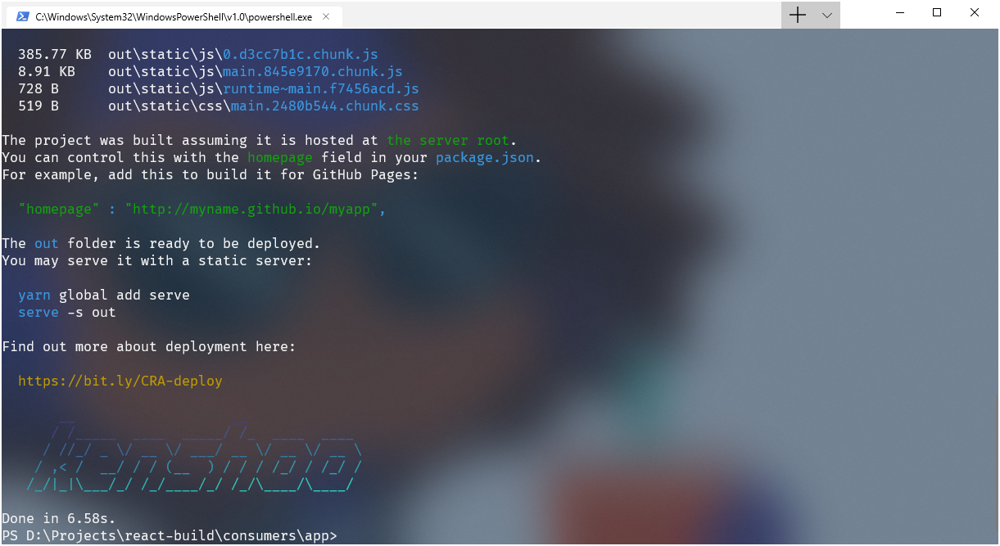

# React Ryo CLI

React Ryo CLI is a roll-your-own version of the famous CRA ("create-react-app") CLI, where you can reconfigure internal configurations, such as Webpack and Jest. This package is based on [CRA](https://github.com/facebook/create-react-app), [Craco](https://github.com/sharegate/craco), and [nwb](https://github.com/insin/nwb). Using the aforementioned third-parties, we are able to abstract away the intricacies of cross-industry build tools and their configurations, yet keep a "roll-your-own" approach to apply fine-grain changes to suit our specific needs.

## Features

- Fully customizable.
- Scalable, more future-proof.
- Supports adherence to industry standards.
- Uses `nwb` behind the scenes for building components.
- Uses `create-react-app` behind the scenes for building applications.
- Abstracts away intricate configuration, which helps avoiding configuration pitfalls.
- Setups Jest and Enzyme with real-world configuration, so you can focus on writing tests only.

## Preview

